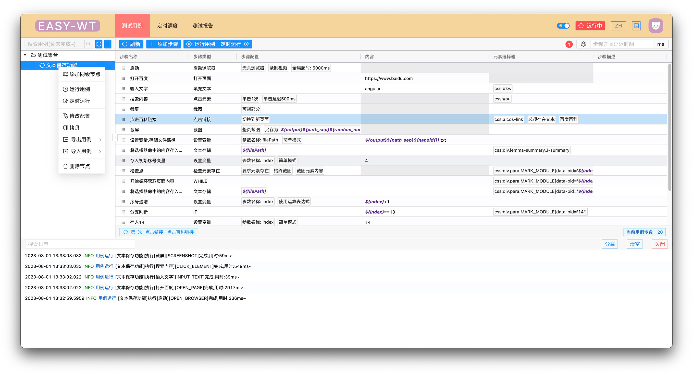
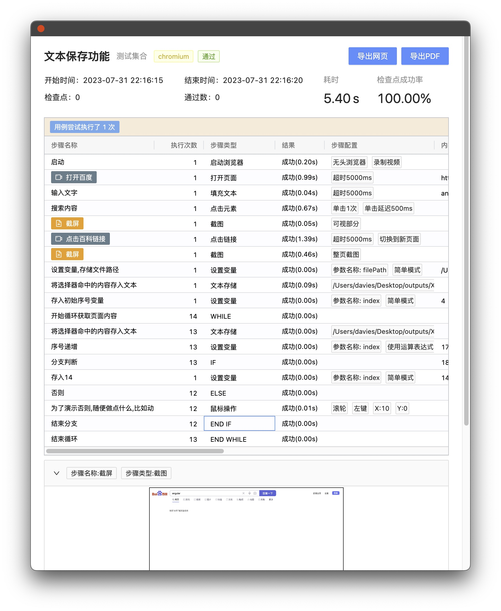
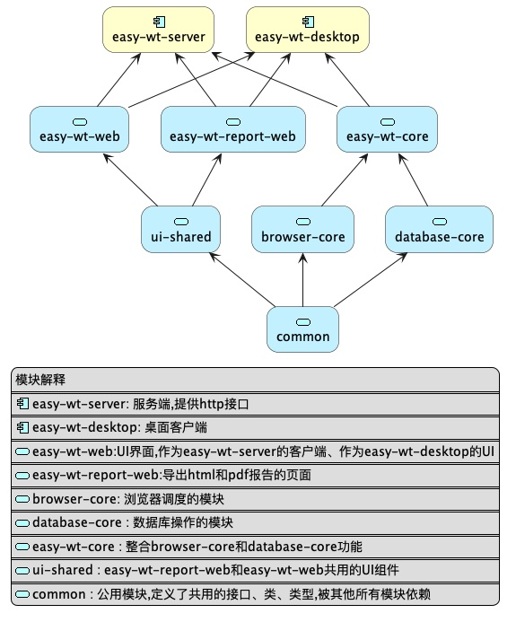

# Easy-Web-Test

基于[playwright](https://playwright.dev/)的一个WEB自动化测试工具

**如果这个小工具在任何地方帮助到你,请给个Star⭐️,这将激励我继续学习❤️**




## 特性和亮点

* 用例管理
* 并发执行
* 定时执行
* 用例执行报告
* 服务端部署
* 多平台客户端支持 `windows` `mac` `linux`
* 多数据库支持 `sqlite`  `mysql`
* 多浏览器支持 `chrome` `edge` `firefox` `safari`

### 其他常规功能

* 多页面切换测试
* 全页面截图,可见区域截图,指定元素截图
* 录制测试过程
* 用例失败重试
* 步骤失败重试
* 导出详细的HTML报告和PDF报告
* 无需任何浏览器驱动,指定浏览器执行文件路径即可
* 无需编程 Excel式的用例编写过程
* 执行进度实时展示
* 支持步骤循环执行
* 支持分支判断
* 支持用例导入、导出,便于跨数据库分享用例

## 使用

### 手册
[使用手册](./doc/wiki/catalog.adoc)

### 例子

可通过导入功能查看
* [循环,文本保存等功能演示](./example)
* 更多案例待补充

### 安装包

[releases](https://gitee.com/davieszhang/easy-wt/releases)

## 开发




```npm
npm i
```


安装遇到问题，参考
[ELECTRON安装文档](https://www.electronjs.org/zh/docs/latest/tutorial/installation)

#### 首先启动web端

```npm
npm run web:dev
```

#### 进行桌面端开发

```npm
npm run desktop:dev
```

#### 进行服务端开发

```npm
npm run server:dev
```

## 打包

#### 桌面端

自动根据当前环境打包桌面端安装包,windows下构建exe,mac os构建dmg

```npm
npm run desktop:production
```

#### 服务端

同时构建server和web

```npm
npm run server:production
```

默认情况下 启动server
通过 `http://host:port` 即可访问到客户端

如需部署到nginx web客户端构建文件在`dist/easy-wt-server/assets`


## 联系我


如果喜欢这个工具可以关注我

不定期分享一些使用技巧、源码解释、开发计划等等


