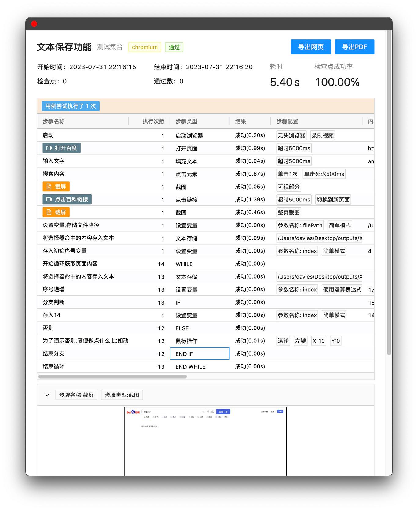

# Easy-Web-Test

基于[playwright](https://playwright.dev/)的一个简单WEB自动化测试工具

* 用例管理
* 并发执行
* 定时执行
* 用例执行报告
* 服务端部署
* 多平台客户端支持 `windows` `mac` `linux`
* 多数据库支持 `sqlite`  `mysql`
* 多浏览器支持 `chrome` `edge` `firefox` `safari`





## 使用

下载对应平台的构建包

## 开发


```npm
#当前版本必须加上--force,因为angular16才发布
#jest-preset-angular还未更新,但实际不影响
npm i --force
```

如果安装遇到问题，参考
[ELECTRON安装文档](https://www.electronjs.org/zh/docs/latest/tutorial/installation)

#### 首先启动web端

```npm
npm run web:dev
```

#### 进行桌面端开发

```npm
npm run desktop:dev
```

#### 进行服务端开发

```npm
npm run server:dev
```

## 打包

#### 桌面端

自动根据当前环境打包桌面端安装包,windows下构建exe,mac os构建dmg

```npm
npm run desktop:production
```

#### 服务端

同时构建server和web

```npm
npm run server:production
```


