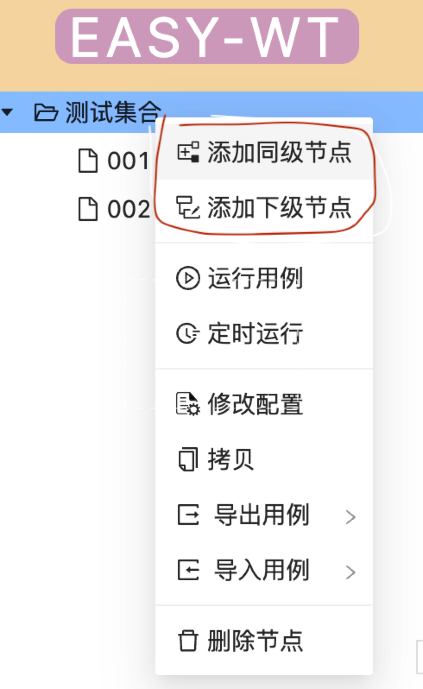

= 用例创建

:data-uri:

[.lead]
其他文档链接🔽

include::catalog.adoc[leveloffset=1]

.用例配置具有向下传递的特性
****
用例目录树上级的配置内容会自动传递给下级目录或用例

所以如果可能想在多个用例之前共用一份配置,比如运行时变量,重试次数等,可以将他们放在同一个目录下

****

TIP: 在用例树节点上单击右键可以新建 用例/目录

|===
|字段 |必填|含义 |默认值

|名称
|是
|用例的名称
|

|节点类型
|是
|标记当前节点是作为目录还是用例.
|用例

|测试浏览器
|作为当前用例树的顶级节点时必须填写.作为子节点如果不填写会自动继承父级节点的配置
|当前用例需要在哪些浏览器上面运行
|

|用例重试次数
|否
|当用例意外失败后,重试的次数(当前版本 *检查点步骤失败* 属于预料之中,所以不会重试)
|

|步骤重试次数
|否
|当用例中的步骤失败后,重试的次数(当前版本 *检查点步骤失败* 属于预料之中,所以不会重试)
|

|运行变量
|否
|运行过程中的变量,可以在步骤中通过${变量名}的方式使用它
|

|===

