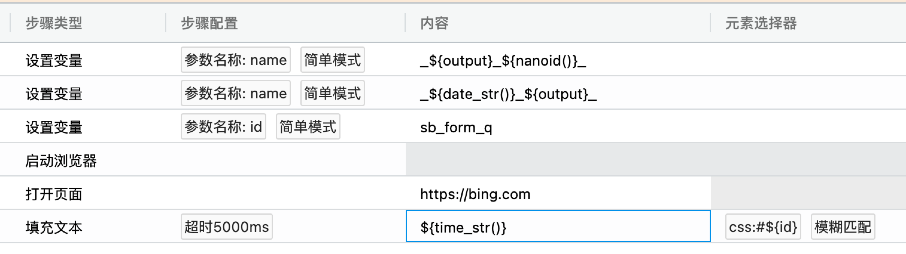
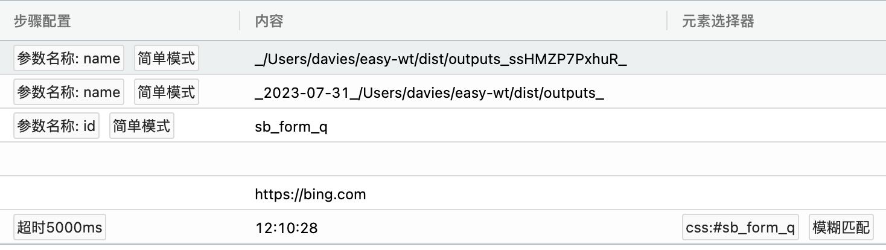

= 运行时参数

:data-uri:

[.lead]
其他文档链接🔽

include::catalog.adoc[leveloffset=1]

[quote,我自己,Easy-WT]
____
如果不支持运行时变量,用例编写将会变得无比麻烦
____

*用例步骤编写的任何输入框,理论上都可以使用变量*

变量占位符使用

[source,javascript]
----
${变量名}
----

系统内支持一些默认变量

[source,javascript]
----
//环境变量中配置的输出目录
${output}

/**
* 运行对应步骤时,生成一个长度为12的唯一字符串
* link https://github.com/ai/nanoid
*/
${nanoid()}

/**
* 运行对应步骤时,生成当前日期的字符串,比如2013-12-13
*/
${date_str()}

/**
* 运行对应步骤时,生成当前时间的字符串,比如13:21:13
*/
${time_str()}
----

比如:

运行时结果:

