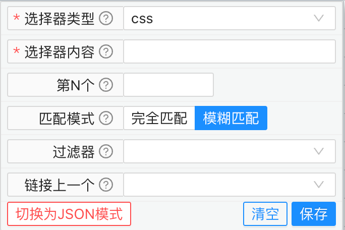

= 初始化配置

[.lead]
其他文档链接🔽

include::catalog.adoc[leveloffset=1]

.元素选择器用于定位页面上的元素
****
虽然本工具号称无需编程,但是依然还是存在一个学习门槛<元素选择器>

有很多种手段可以辅助生成元素选择器,但是自动生成的元素选择器很多情况下并不可靠

因为大多数工具处理的元素选择器在复杂元素选取上面还是依赖页面DOM结构,但是页面DOM结构变动往往相对频繁

一个完善、健壮的用例,页面轻微调整不会导致用例失败,所以元素选择器必须慎重去选择

****

对于本工具元素选择器的规则,最好的文档是参照
https://playwright.dev/docs/locators[playwright的定位器文档]

选择器类型::

Role::

[source,html]
----
<h3>Sign up</h3>
<label>
  <input type="checkbox" /> Subscribe
</label>
 
<button>Submit</button>
----

.Role <h3>Sign up</h3>
====
选择器类型 role

选择器内容 heading

过滤器 必须存在文本

过滤器内容 Sign up
====

.Role <input type="checkbox" /> Subscribe
====
选择器类型 role

选择器内容 checkbox

过滤器 必须存在文本

过滤器内容 Subscribe
====

.Role <button>Submit</button>
====
选择器类型 role

选择器内容 button

过滤器 必须存在文本

过滤器内容 Submit
====

AltText::

[source,html]
----

----

.AltText
====
选择器类型 AltText

选择器内容 easy-wt logo
====

Placeholder::

[source,html]
----
<input type="email" placeholder="name@example.com" />
----

.Placeholder
====
选择器类型 Placeholder

选择器内容 name@example.com
====

Text::

[source,html]
----
Welcome, John
----

.Text-1
====
选择器类型 Text

选择器内容 Welcome, John

匹配模式 完全匹配
====

.Text-2
====
选择器类型 Text

选择器内容 Welcome

匹配模式 模糊匹配
====

Title::

[source,html]
----
25 issues
----

.Title
====
选择器类型 Title

选择器内容 Issues count

匹配模式 完全匹配
====

Label::

[source,html]
----
<label>Password <input type="password" /></label>
----

.Label
====
选择器类型 Label

选择器内容 Password
====

Css::
css选择器是强大的页面元素原则器,规则繁多,理论上来说掌握它可以定位任何页面元素,可自行搜索相关文档了解
https://developer.mozilla.org/zh-CN/docs/Web/CSS/CSS_Selectors[CSS_Selectors]

XPath::
xpath选择器是强大的页面元素原则器,规则繁多,理论上来说掌握它可以定位任何页面元素,可自行搜索相关文档了解
https://www.runoob.com/xpath/xpath-syntax.html[xpath选择器]

'''

当选择器为文本内容相关的查找时,匹配器规则会生效

`AltText` `Placeholder` `Text` `Label` `Title`

匹配模式::
对于内容的匹配规则
完全匹配:::
必须完全符合所描述的内容
模糊匹配:::
部分符合所描述的内容

'''

过滤器::
当前一步选择器无法精确定位到元素时,可以再根据 元素内部或子元素 文本过滤
必须存在文本:::
所描述文本内容在其元素或子元素内必须存在
必须不存在文本:::
所描述文本内容在其元素或子元素内必须不存在

'''

链接上一个::
当你在前一个步骤已经存在元素选择器时 你可以指定与前一个元素选择器的关系
作为子选择器:::
当前的元素选择器的定位范围是上一个选择器命中的范围,可使用这种关系进一步缩小匹配范围
并且:::
要同时符合上一个元素选择器和当前的元素选择器
或者:::
上一个元素选择器或当前的元素选择器存在任何一个
