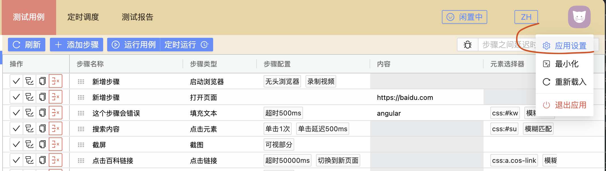
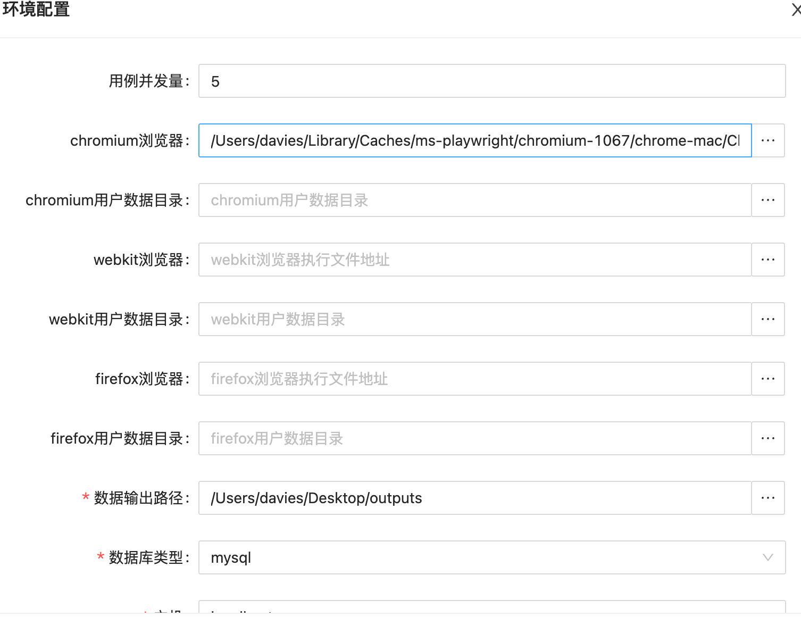

= 初始化配置

:data-uri:

[.lead]
其他文档链接🔽

include::catalog.adoc[leveloffset=1]

==== 字段含义

|===
|字段 |必填|含义 |默认值

|用例并发量
|是
|同时执行的用例数量,根据自己的机器配置设定(对于同一个用例不同浏览器的单次执行.总是串行的,意味着同一个用例不会同时在不同浏览器上执行)
|5

|chromium浏览器
|是
|指定浏览器所在的可执行文件路径,windows下指定对应exe或者快捷方式均可.(理论上来说chromium内核的浏览器都支持测试,比如国产的一些套壳浏览器)
|必须指定chromium浏览器路径,很多核心功能依赖它

|chromium用户数据目录
|否
|指定用户数据目录后,可保存浏览器会话,比如记住密码的网站,用例再次打开,无需登录
|

|webkit浏览器
|否
|webkit内核浏览器执行文件路径,如果需要测试此浏览器需要填写
|

|webkit用户数据目录
|否
|同 chromium用户数据目录
|

|firefox浏览器
|否
|firefox浏览器执行文件路径
|

|firefox用户数据目录
|否
|同 chromium用户数据目录
|

|数据输出路径
|是
|测试所产生的文件存储路径,比如截图,录制的操作过程等
|应用程序用户数据目录

|数据库类型
|是
|如果支持两种数据库,内置的sqlite和mysql
|sqlite

|数据库文件路径
|是
|如果选择sqlite数据库,sqlite数据库文件存储的路径
|应用程序用户数据目录

|主机
|是
|当选择mysql数据库时必填
|

|端口
|是
|当选择mysql数据库时必填
|

|数据库
|是
|当选择mysql数据库时必填
|

|数据库用户名
|是
|当选择mysql数据库时必填
|

|数据库密码
|否
|当填写了数据库密码后,应用程序会加密存储,避免简单扫描泄露(服务端部署时未加密)
|

|===

